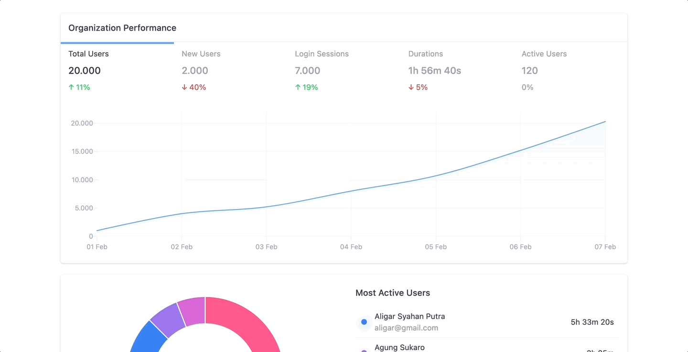

# Simple Data Visualization

#### https://simple-data-viz.vercel.app/

This simple project show how i tried [Visx](https://github.com/airbnb/visx), a low-level visualization primitive of [D3](https://github.com/d3/d3) made for React.

Its really hard and bad practices to implement D3 in React world, because a lot of DOM manipulation happening under the hood.

So i found this really helpful. Still low level and un-opinionated, brings whatever data visualization to life.

## Technology

For this simple project, i used :

1. [NextJS](https://github.com/vercel/next.js/)
2. [Visx](https://github.com/airbnb/visx)
3. [TailwindCSS](https://github.com/tailwindlabs/tailwindcss)
4. [date-fns](https://github.com/date-fns/date-fns)

## Get This Project

Download or clone this repository and type `yarn dev` in your terminal
